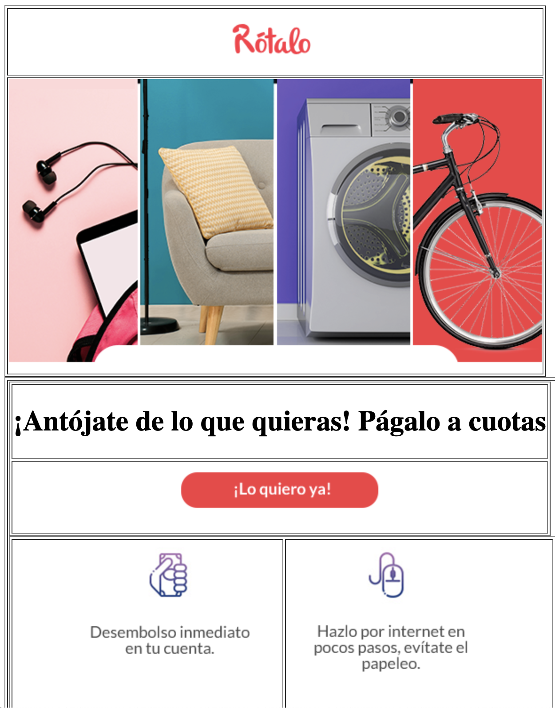

# Repositorio para enseñar a mi novia diseñadora a cortar un email html

Html básico, con algo de estilos css y tal vez Javascript básico.

## ¿Cómo funciona?

Abre en un navegador el archivo index y te funcionara, lo puedes hacer con click derecho abrir con, Chrome, o simplemete con doble click.

## Problemas detectados hasta el momento

* ¿Cómo enlazar imágenes? 

Al tratar de enlazar las imagenes con Dreamweaver, la ruta de la imagen queda con un path local, que apunta a `file/xxxx/xxxx` -> esto funciona en Dreamweaver y en tu computador, pero cuando lo abres en otro computador la ruta se pierde por eso es mejor llamar la ruta absoluta desde tu aplicacion web, por eso cree una nueva carpeta que se llama /images en donde guarde las imagenes y ahora el path es `./images/nombredelaimagen.png`, ahora puedes agredar mas fotos por favor practica elazar nuevas imagenes.

## Licencia

MIT
